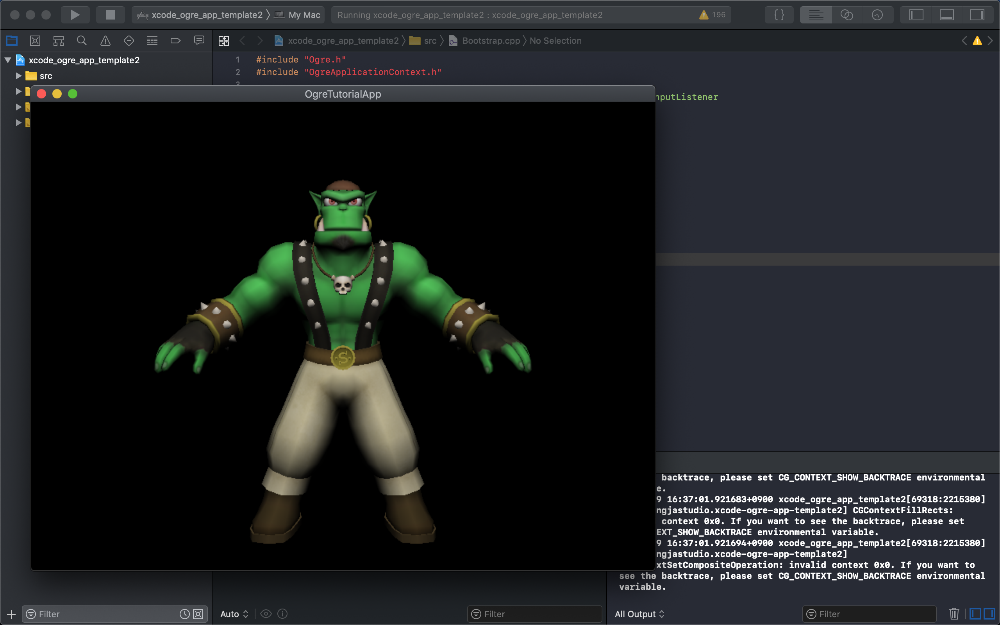

# ogre_1_12_1_osx
This is a pre-built SDK of OGRE-1‐12-1 for OSX including Xcode based bootstrap template.

All the dependent libraries are built in Dependencies directories.
All the necessary libraries are copied into Frameworks folder of app bundle.

Basically you don't have to do anything to build the bootstrap sample.
Just clone this repo and build with Xcode.

Enjoy and just let me know if there is any build issue.

By the way, I'm using Macbook Pro with macOS 10.14.6 and Xcode 10.3.

Maybe much better way is to create an SDK/Dependency build shell script but I'm satisfied enough now to be able to explore Ogre3D.
